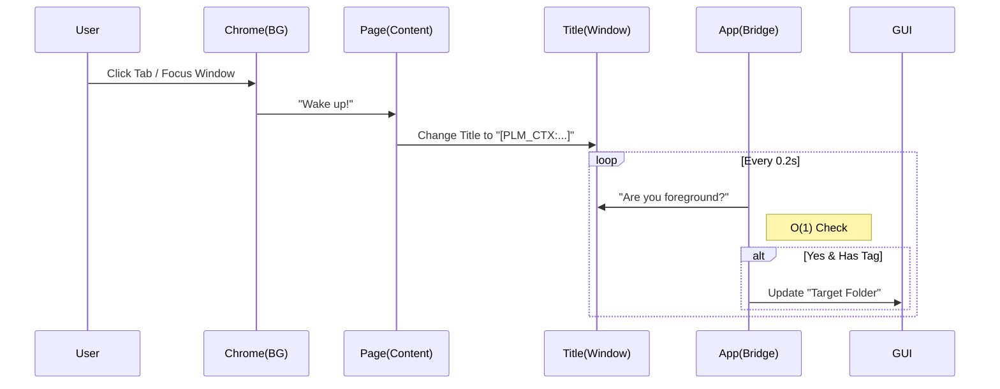

# PLM Organizer - System Architecture (v1.7.4)

## 1. Process & Thread Structure (The "Lightweight" Model)

The application consists of two independent processes: the **Chrome Extension** (in the browser) and the **Desktop App** (your PC). They communicate *indirectly* via the Window Title.

### A. Chrome Extension (Process 1)
*   **Background Worker (`bg.js`)**: 
    *   **Type**: Event-Driven Service Worker (Sleeps 99% of time).
    *   **Trigger**: Wakes up ONLY when you click a tab (`onActivated`) or switch windows (`onFocusChanged`).
    *   **Action**: Sends a signal to the active tab: "Update your title now!"
*   **Content Script (`content.js`)**: 
    *   **Type**: Injected Script (runs inside the web page).
    *   **Action**: Scrapes data -> Appends `[PLM_CTX:...]` to document title.

### B. Desktop App (Process 2 - `main.py`)
The Python app runs as a single process with **3 internal threads**:

1.  **Main Thread (GUI)**
    *   **Role**: Draws the UI (PyQt6), handles mouse clicks, updates the "Target Folder" label.
    *   **Priority**: High (Must never freeze).
    
2.  **Ghost Bridge Thread (`bridge.py`)** 👻
    *   **Role**: Data Receiver.
    *   **Logic (v1.7.2 Optimized)**:
        *   Loop every **0.2 seconds**.
        *   Check **ONE** thing: "Is the foreground window's title tagged?" (Cost: ~0 CPU).
        *   If yes -> Update Context.
        *   If no -> Sleep.
    
3.  **File Watcher Thread (`watcher.py`)**
    *   **Role**: File System Monitor.
    *   **Logic**: Waits for files to appear in `Downloads/MyPLM`. When a file drops, it moves it to the target folder.

## 2. Data Flow Diagram

## 3. Why this is efficient?
*   **No Server**: No open ports, no firewall issues.
*   **Lazy Polling**: The App ignores background windows. It only looks at what YOU are looking at.
*   **Event Driven**: The Extension does nothing until you click.
